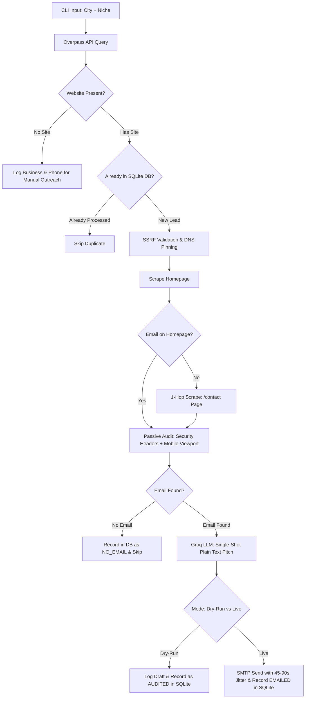

# Product Requirements Document (PRD)

## Project: Web Design Prospector Automation
**Author:** Engineering & Product  
**Status:** Approved / Active Implementation  
**Version:** 2.0.0 (Production Focused)  
**Target Environment:** Python 3.10+ (Zero external dependencies)

---

## 1. Executive Summary & Problem Statement

### 1.1 The Problem
Freelance web designers and boutique agencies spend excessive time and capital on customer acquisition:
- Traditional B2B prospecting tools (Apollo, Hunter, ZoomInfo) charge $100–$500+/month with artificial credit constraints.
- Generic cold outreach suffers from abysmal response rates (<1%) because pitches lack concrete value or relevant audit insights.
- Small local businesses (e.g., plumbers, electricians, dentists, roofers) often run insecure, neglected, or non-mobile-friendly websites, but standard scrapers fail to detect actionable technical leverage points.

### 1.2 The Solution
**Web Design Prospector Automation** is an autonomous, zero-dependency, zero-marginal-cost CLI engine that acts as an automated technical sales prospecting pipeline:
1. **Discovers** local business leads via OpenStreetMap's free Overpass API.
2. **Validates & Scrapes** websites with strict Server-Side Request Forgery (SSRF) and DNS-pinning protections.
3. **Audits** the site for high-impact flaws: passive HTTP security headers (CSP, HSTS, Clickjacking) and mobile responsiveness (`<meta name="viewport">`).
4. **Enriches Contact Data** with a 1-hop fallback to `/contact` if the homepage omits an email address.
5. **Generates Hyper-Targeted Pitches** in a single low-latency LLM call via Groq (`llama-3.3-70b-versatile`), producing short (under 4 sentences), human-sounding plain-text emails.
6. **Manages State & Delivery** using a lightweight SQLite ledger to guarantee idempotency (never re-contacting the same business) and SMTP sending jitter to safeguard email deliverability.

---

## 2. Core Architectural Principles ("Ponytail" Standard)

1. **Strict Zero-Dependency Stdlib:** Built 100% on the Python Standard Library (`urllib`, `re`, `json`, `smtplib`, `socket`, `ipaddress`, `ssl`, `sqlite3`). No `requests`, `bs4`, `dnspython`, or external packages.
2. **Deliverability First (Plain Text Only):** Zero attachments, zero tracking pixels, zero spam-trigger buzzwords. First cold touches must look like a normal human email to pass corporate filters (Google Workspace / Microsoft 365).
3. **SSRF Safe by Design:** Outbound HTTP requests enforce DNS IP resolution validation, private IP blacklisting, DNS pinning to defeat DNS rebinding, and redirect inspection.
4. **Idempotent by Default:** Backed by an embedded SQLite ledger (`leads.db`). Running the script repeatedly across the same city/niche skips already processed or contacted businesses.

---

## 3. End-to-End Workflow



---

## 4. Functional Requirements (FR)

### FR-1: Lead Discovery (Overpass API / OpenStreetMap)
- **FR-1.1:** System shall accept user-defined `city` and `business_type` via CLI prompt.
- **FR-1.2:** System shall map plain-language keywords to OpenStreetMap Overpass QL tags (e.g., `plumber` -> `craft=plumber`, `dentist` -> `amenity=dentist`, `restaurant` -> `amenity=restaurant`, fallback: `name~"{term}",i`).
- **FR-1.3:** Query shall extract business name, website URL (`website` or `contact:website`), and phone number (`phone` or `contact:phone`).
- **FR-1.4:** Non-website businesses shall be surfaced immediately with phone numbers for manual phone prospecting.

### FR-2: SSRF & Network Security Layer
- **FR-2.1:** Every target URL must pass strict scheme validation (`http`, `https` only).
- **FR-2.2:** Resolved host IP addresses must be evaluated against `ipaddress.ip_address(ip).is_global`. Any private, loopback, link-local, multicast, or reserved address (e.g., `127.0.0.1`, `10.0.0.0/8`, `192.168.0.0/16`, `169.254.0.0/16`) must be rejected.
- **FR-2.3:** Validated IP addresses must be pinned in an in-memory mapping (`_dns_pin`) to prevent Time-of-Check to Time-of-Use (TOCTOU) DNS rebinding attacks.
- **FR-2.4:** `SafeRedirectHandler` must intercept HTTP 3xx redirects to ensure redirected targets undergo identical security validation.
- **FR-2.5:** System proxy bypassing must be enforced (`ProxyHandler({})`) so environment proxies cannot redirect pinned outbound traffic.

### FR-3: Scraper & 1-Hop Contact Enrichment
- **FR-3.1 (Homepage Scrape):** Fetch homepage HTML with strict timeout (8s) and 100 KB payload cap.
- **FR-3.2 (Email Extraction):** Extract email addresses using prioritized `mailto:` detection and RFC 5322 regex fallback, filtering out image false-positives (`.png`, `.jpg`, `.gif`).
- **FR-3.3 (1-Hop /contact Fallback):** If no email is discovered on the homepage:
  - System shall inspect internal links matching `/contact`, `/contact-us`, `/about`, or construct `https://domain.com/contact`.
  - Fetch the single contact subpage (subject to identical SSRF and timeout rules) to extract the email.
- **FR-3.4 (Text Extraction):** Strip scripts, styles, and markup; extract up to 2,000 characters of clean text for LLM context.

### FR-4: Passive Technical Audit Engine
- **FR-4.1 (Passive Security Headers):**
  - **CSP:** Flag missing `Content-Security-Policy`.
  - **HSTS:** Flag missing `Strict-Transport-Security`.
  - **Clickjacking:** Flag missing `X-Frame-Options` or `frame-ancestors`.
- **FR-4.2 (Mobile Responsiveness Check):**
  - Scan HTML `<head>` for `<meta name="viewport">`.
  - Flag missing viewport tag as critical signal: *"Website is not configured for mobile devices / smart phones."*

### FR-5: Single-Shot AI Copywriting (Groq REST API)
- **FR-5.1:** Invoke Groq REST API (`https://api.groq.com/openai/v1/chat/completions`) using standard `urllib.request`.
- **FR-5.2:** Model: `llama-3.3-70b-versatile` (or configured Groq model).
- **FR-5.3:** Single-Shot Prompt: Feed business name, website snippet, missing security headers, and mobile viewport status. Generate pitch in a single round-trip.
- **FR-5.4:** Pitch Constraints:
  - Strictly under 4 sentences.
  - 100% plain text (no HTML, no Markdown links, no attachments).
  - Friendly, neighborly, consultative tone (zero spam buzzwords like "guarantee", "act now", "free audit").
- **FR-5.5:** Deterministic fallback draft on API error/timeout so the pipeline never crashes.

### FR-6: Persistence & Deliverability Engine
- **FR-6.1 (SQLite Ledger):** Embedded `leads.db` with table:
  ```sql
  CREATE TABLE IF NOT EXISTS leads (
      id INTEGER PRIMARY KEY AUTOINCREMENT,
      name TEXT NOT NULL,
      city TEXT NOT NULL,
      website TEXT UNIQUE,
      phone TEXT,
      email TEXT,
      audit_findings TEXT,
      status TEXT, -- 'DISCOVERED', 'NO_EMAIL', 'AUDITED', 'EMAILED', 'FAILED'
      created_at TIMESTAMP DEFAULT CURRENT_TIMESTAMP,
      emailed_at TIMESTAMP
  );
  ```
- **FR-6.2 (Deduplication):** Before inspecting or emailing a lead, query `leads.db` by website domain. Skip previously audited/emailed records.
- **FR-6.3 (SMTP Sending Jitter):** When live sending is active, enforce randomized delay (45–90 seconds) between email dispatches to mimic human pacing and prevent Gmail/SMTP rate bans.
- **FR-6.4 (Dry-Run Mode):** Default execution logs generated email subject and body to console and marks status as `AUDITED` in SQLite without sending.

---

## 5. Non-Functional Requirements (NFR)

| Category | Requirement | Specification |
| :--- | :--- | :--- |
| **Dependencies** | Strict Zero-Dependency | 100% Python Standard Library. Zero pip installs. |
| **Persistence** | Embedded SQLite | Stored in `leads.db` in project root. Zero server setup. |
| **Deliverability** | Plain Text Only | 0 attachments, 0 tracking pixels, 45–90s randomized delay. |
| **Safety** | SSRF & DNS Pinning | Internal IP blocking + DNS pinning to prevent intranet traversal. |
| **Operating Cost** | Zero Overhead | $0.00 / month on standard usage tiers. |

---

## 6. Implementation Roadmap

### Phase 1: Core Engine (Complete)
- [x] Overpass API query integration.
- [x] Strict SSRF protection with DNS pinning.
- [x] Homepage text & email regex extraction.
- [x] Passive HTTP security header scanning.
- [x] Groq LLM prompt generation.
- [x] Native SMTP dispatch with dry-run protection.

### Phase 2: "Deep Audit" & Persistence (Complete)
- [x] **SQLite Ledger (`leads.db`):** Create schema, check domain uniqueness before processing, record audit and email status.
- [x] **Mobile Viewport Check:** Implement regex detection for `<meta name="viewport">` in `prospector.py` and pass result into prompt.
- [x] **1-Hop `/contact` Fallback:** If homepage email search yields `None`, inspect candidate `/contact` subpage.
- [x] **Human-Mimicking Jitter:** Implement `random.uniform(45, 90)` sleep between dispatches in the SMTP sending loop.
